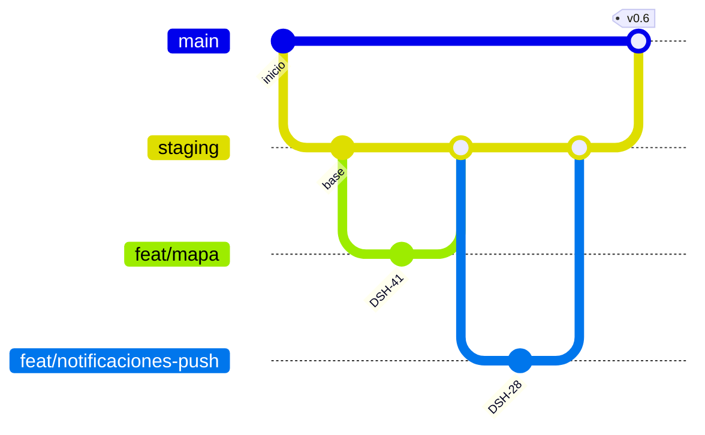

# Modelo de ramas (Git)

Estrategia de ramas que sigue el equipo de Dasha para trabajar ordenado y sin
romper producción.

- **`main`**: producción. Solo recibe merges desde `staging`. Nadie trabaja aquí directo.
- **`staging`**: integración. Todo se prueba aquí antes de liberar.
- **`feat/` · `fix/` · `chore/`**: una rama por tarea. Sale de `staging` y regresa por Pull Request.

Cada commit sigue Conventional Commits y lleva su código de JIRA para
trazabilidad (por ejemplo `feat(notificaciones): web push (DSH-28)`).

## Flujo de trabajo

1. Se crea una rama desde `staging` con el prefijo según el tipo de cambio
   (`feat/`, `fix/`, `chore/`, `docs/`).
2. Se trabaja y se prueba (`lint`, `typecheck`, `build` y revisión en el navegador).
3. Se abre un Pull Request hacia `staging`. Al abrirlo, **GitHub Actions (CI)**
   corre automáticamente `lint` y `build` de frontend y backend; si algo falla,
   no se integra.
4. Se revisa el Pull Request y se integra a `staging`.
5. Cuando `staging` está estable, se libera a `main` (producción).

## Despliegue (CD)

- **Frontend:** desplegado en **Vercel**, que publica automáticamente en cada
  integración. La rama `staging` publica en `staging.dashamx.me` (pruebas); la
  rama `main` publicará en `dashamx.me` (producción), pendiente hasta pulir para
  la entrega final.
- **Backend:** desplegado en un **Droplet de DigitalOcean** (por SSH), a cargo
  del área de backend.
